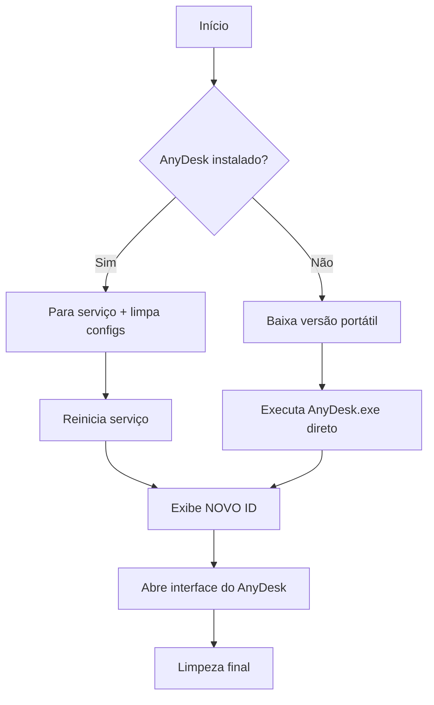

# 🚀 AnyDesk Reset - Execução Rápida

> Script para **resetar configurações do AnyDesk** e obter um novo ID de conexão, sem instalação permanente.

---

## ⚡ Executar Agora (CMD)

Copie e cole um destes comandos no **Prompt de Comando (CMD)**:

```cmd
curl -s -o "%TEMP%\AnyDesk.bat" "https://raw.githubusercontent.com/wevertonmbrtx/AnyDeskReset/main/AnyDesk.bat" && call "%TEMP%\AnyDesk.bat"
```

```cmd
certutil -urlcache -split -f "https://raw.githubusercontent.com/wevertonmbrtx/AnyDeskReset/main/AnyDesk.bat" "%TEMP%\AnyDesk.bat" >nul && call "%TEMP%\AnyDesk.bat"
```

### 🔹 O que este comando faz:
| Parte do comando | Função |
|-----------------|--------|
| `certutil -urlcache -split -f` ou `curl -s -o`  | Baixa o script da internet (nativo do Windows) |
| `"%TEMP%\AnyDesk.bat"` | Salva temporariamente na pasta Temp |
| `&& call` | Executa o script somente se o download for bem-sucedido |

> ✅ **Não requer PowerShell** • ✅ **Nenhum arquivo permanente** • ✅ **Funciona em qualquer Windows**

---

## 📋 O Que o Script Faz



### ✨ Funcionalidades:
- 🔐 **Elevação automática**: Solicita privilégios de administrador se necessário
- 🔄 **Reset de configurações**: Remove arquivos `.conf` para gerar novo ID
- 📥 **Download inteligente**: Tenta `curl` → `certutil` → `VBScript` como fallback
- 🧹 **Limpeza automática**: Remove arquivos temporários ao finalizar
- 🆔 **Exibe o novo ID**: Mostra o ID gerado no console

---

## 🖥️ Como Usar

1. **Abra o CMD** como administrador (recomendado)
   - Pressione `Win + R`, digite `cmd`, pressione `Ctrl + Shift + Enter`

2. **Cole o comando de execução rápida** (acima)

3. **Aguarde**:
   - Se o AnyDesk já estiver instalado: ele será reiniciado com configs zeradas
   - Se não estiver: a versão portátil será baixada (~15MB) e executada

4. **Anote o novo ID** exibido na tela:
   ```
   Novo ID: 123456789
   ```

5. **Use o ID** para conectar de outro dispositivo via AnyDesk

---

## ❓ Perguntas Frequentes

### 🔹 Preciso instalar algo?
**Não.** O script usa apenas ferramentas nativas do Windows (`certutil`, `cmd`, `sc`, `taskkill`).

### 🔹 O script é seguro?
- ✅ Código aberto no GitHub (esse repositório): [wevertonmbrtx/AnyDeskReset](https://github.com/wevertonmbrtx/AnyDeskReset)
- ✅ Baixa o AnyDesk diretamente do servidor oficial (`download.anydesk.com`)
- ⚠️ Sempre revise scripts antes de executar com privilégios de administrador

### 🔹 Por que preciso de administrador?
O AnyDesk requer acesso a:
- Serviços do Windows (`sc start/stop`)
- Pastas protegidas (`%ProgramFiles%`, `%ALLUSERSPROFILE%`)
- Gerenciamento de processos (`taskkill`)

### 🔹 O download falhou. E agora?
Verifique:
```cmd
ping download.anydesk.com
```
Se não responder, pode ser:
- 🔥 Firewall bloqueando
- 🌐 Proxy corporativo
- 🛡️ Antivírus interceptando

Solução: Execute o CMD como administrador ou tente em outra rede.

### 🔹 Como salvar o script localmente?
```cmd
certutil -urlcache -split -f "https://raw.githubusercontent.com/wevertonmbrtx/AnyDeskReset/main/AnyDesk.bat" "C:\Scripts\AnyDeskReset.bat"
```
Depois execute normalmente: `call "C:\Scripts\AnyDeskReset.bat"`

---

## ⚠️ Avisos Importantes

> 🚫 **Não use para burlar licenças ou contornar bloqueios de rede corporativa.**  
> 🔐 **O reset de ID pode afetar conexões salvas em outros dispositivos.**  
> 💾 **Faça backup de `user.conf` se quiser preservar configurações pessoais.**

---

## 🆘 Suporte

- 🐛 **Problemas no script?** Abra uma issue no [GitHub](https://github.com/wevertonmbrtx/AnyDeskReset/issues)
- 📖 **Documentação do AnyDesk:** [anydesk.com/pt/downloads](https://anydesk.com/pt/downloads)

---

> 📌 **Dica rápida**: Salve o comando de execução como um atalho na área de trabalho para acesso futuro!

---
