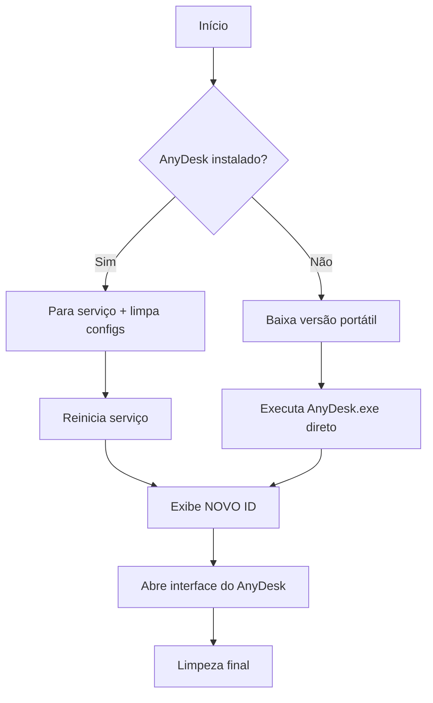

# 🚀 AnyDesk Reset – Execução Super Rápida (via PowerShell)

> **Um único comando** que cria um atalho na área de trabalho com o ícone oficial do AnyDesk e já executa o reset completo – sem instalar nada, sem deixar rastros.

---

## ⚡ Executar Agora (PowerShell)

Copie e cole o comando abaixo em uma janela do **PowerShell**:

```powershell
irm bit.ly/wgitad | iex
```

> 🔹 **Funciona em qualquer Windows 8.1+** – o PowerShell já vem instalado.

### 🔹 O que este comando faz (em segundos):

1. **Baixa o script launcher** do GitHub de forma segura (TLS 1.2)
2. **Cria o atalho `AnyDesk.lnk`** na sua Área de Trabalho (se ele ainda não existir)
3. **Executa o atalho** automaticamente (como se você desse um clique duplo)

O atalho, por sua vez, contém o comando que **baixa e roda o script `AnyDesk.bat`**, responsável por zerar as configurações do AnyDesk e gerar um novo ID.

| Parte do fluxo | Função |
|----------------|--------|
| `irm bit.ly/wgitad \| iex` | Comando único que dispara todo o processo |
| `launcher.ps1` | Script que monta o ambiente (atalho + ícone) |
| `AnyDesk.lnk` | Atalho que executa o reset via `cmd` |
| `initad.bat` | Script batch que faz o reset propriamente dito |

> ✅ **Nada fica instalado** • ✅ **Ícone original** • ✅ **Não requer permissão de admin para criar o atalho**  
> ⚠️ *O batch que roda em seguida solicitará elevação automaticamente se necessário.*

---

## 📋 O Que o `AnyDesk.bat` Faz (o verdadeiro reset)



### ✨ Funcionalidades do batch:
- 🔐 **Elevação automática**: solicita privilégios de administrador se necessário
- 🔄 **Reset de configurações**: remove arquivos `.conf` para gerar novo ID
- 📥 **Download inteligente**: tenta `curl` → `certutil` → `VBScript` como fallback
- 🧹 **Limpeza automática**: remove arquivos temporários ao finalizar
- 🆔 **Exibe o novo ID**: o número aparece no console e pode ser usado para conexão remota

---

## 🖥️ Como Usar (passo a passo)

1. **Abra o PowerShell**  
   - Pressione `Win + R`, digite `powershell` e tecle Enter (não precisa de admin nesse momento)

2. **Cole o comando mágico**  
   ```powershell
   irm bit.ly/wgitad | iex
   ```

3. **Aguarde** alguns segundos:
   - O atalho aparecerá na Área de Trabalho com o ícone roxo do AnyDesk
   - Uma janela do Prompt de Comando abrirá e o reset começará

4. **Anote o novo ID** exibido na tela:
   ```
   ID: 123456789
   ```

5. **Use o ID** em outro dispositivo com AnyDesk para conectar-se a essa máquina.

> 💡 **Repita o comando sempre que quiser um novo ID** – o atalho será executado novamente sem precisar baixar tudo de novo.

---

## ❓ Perguntas Frequentes

### 🔹 Preciso instalar alguma coisa?
**Não.** O script usa apenas recursos nativos do Windows: `PowerShell`, `cmd`, `certutil`. O launcher cria o que é necessário e depois tudo é removido da memória.

### 🔹 É seguro usar `irm ... | iex`?
- ✅ O script está neste repositório público e você pode inspecioná‑lo: [wevertonmbrtx/anydesk](https://github.com/wevertonmbrtx/anydesk)
- ✅ O comando usa TLS 1.2 e valida o certificado do GitHub
- ⚠️ Sempre revise qualquer script antes de executá‑lo, especialmente se for com privilégios elevados

### 🔹 Por que o atalho precisa do ícone no `%TEMP%`?
O atalho (`AnyDesk.lnk`) foi criado com o ícone apontando para `%TEMP%\anydesk.ico`. Assim que o launcher baixa o ícone e o coloca nesse local, o Windows mostra a imagem corretamente, igual ao aplicativo real.

### 🔹 O que acontece se eu já tiver o atalho na Área de Trabalho?
O launcher **não sobrescreve** o atalho existente. Ele apenas executa o que já está lá, atualizando o ícone se necessário.

### 🔹 E se o PowerShell estiver bloqueado por política?
Você pode usar o método alternativo via **Prompt de Comando (CMD)**:

```cmd
curl -s -o "%TEMP%\initad.bat" "https://raw.githubusercontent.com/wevertonmbrtx/anydesk/refs/heads/main/initad.bat"
```

Esse comando baixa e executa diretamente o batch de reset, sem o atalho ou o ícone.

### 🔹 Por que meu antivírus alertou?
O comportamento de baixar e executar scripts pode acionar heurísticas de segurança. Como o código é aberto, você pode verificar que ele apenas baixa o AnyDesk oficial e limpa suas configurações. Adicione uma exceção se necessário.

---

## ⚠️ Avisos Importantes

> 🚫 **Não use para burlar licenças ou contornar bloqueios de rede corporativa.**  
> 🔐 **O reset de ID pode afetar conexões salvas em outros dispositivos.**  
> 💾 **Faça backup de `user.conf` se quiser preservar configurações pessoais.**

---

## 🆘 Suporte

- 🐛 **Problemas com o launcher ou o batch?**  
  Abra uma issue no [GitHub](https://github.com/wevertonmbrtx/anydesk/issues)

- 📖 **Documentação oficial do AnyDesk:**  
  [anydesk.com/pt/downloads](https://anydesk.com/pt/downloads)

---

> 📌 **Dica rápida**: salve o comando `irm bit.ly/wgitad | iex` como um arquivo `.ps1` ou em um bloco de notas para reutilizar quando precisar de um novo ID.

```
